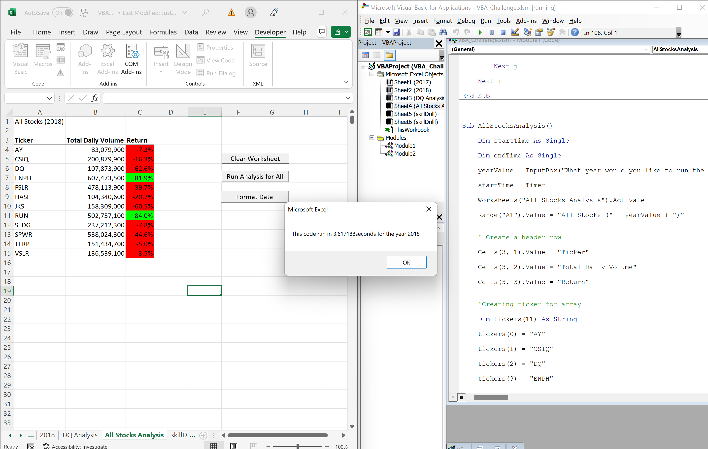
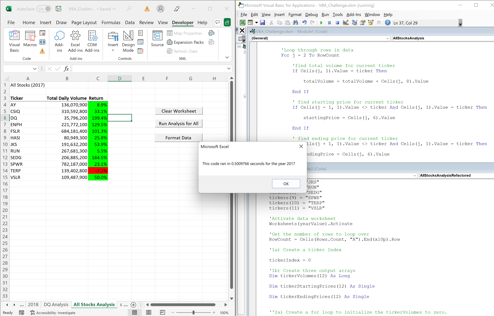
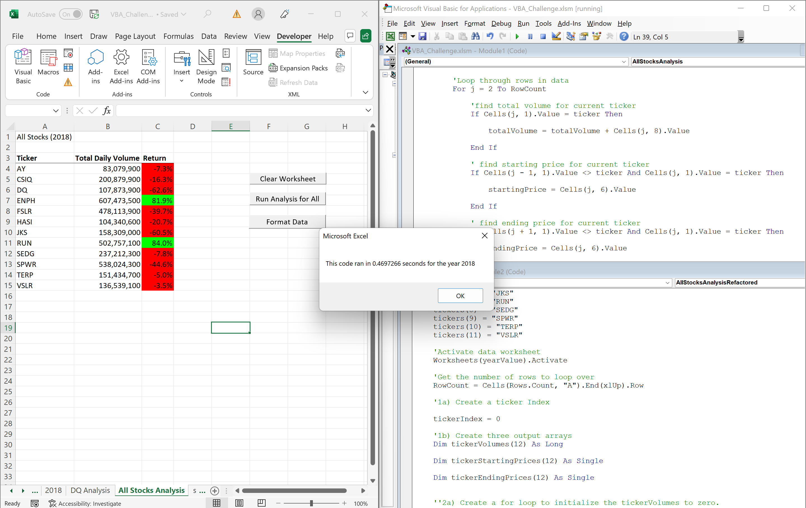

# Stocks-Analysis
Module 2 challenge

## Overview of Project

#### Background
After creating a workbook for Steve that can help him analyze dataset wit a click of a button; he now would like the workbook to be expanded so that he can analyze even bigger data over a longer period of time.

#### Purpose
The purpose of this challenge is to take our analyzed solution from module 2 and refactor it so that we can make it run faster with more data.
    

## Results

#### module 2017
When analyzing the data in the module for 2017 it was found that only ENPH(129.5%) and RUN(5.5%) had a positive return.

This 2017 dataset ran in 3.625 seconds

#### module 2018
When analyzing the data in the module for 2018 it was discovered that the same companies(compared to module 2017) had a positive return. ENPH with 81.9% and RUN with 84.0% .  

This 2018 dataset ran in 3.617188 seconds

#### Challenge 2017
When analyzing the data in the challenge for 2017 the results were astonishingly different than module 2017. All companies except TERP(-7.2%) had a positive return. 

This 2017 dataset ran in 0.5009766 seconds

#### Challenge 2018
When analyzing the data in the challenge for 2018 it was discovered that the same companies as module 2018 had a positive return. ENPH with 81.9% and RUN with 84.0% .

This 2018 dataset ran in 0.4697266 seconds

    
## summary
REFACTORING CODE IN GENERAL

The advantages of refactoring code is that you can give it a second look and find any possible bugs, find ways to make it easier to read, or even make the code more clean and organized to the point where it could run faster.

The disadvantages of refactoring code could be that if you dont fully understand how the code works then you could just be causing bugs and that could lead to the code not working. Another disadvantage could be if when youre refactoring there isnt that much time to fully test out the code and make sure verything works properly.

REFACTORING VBA SCRIPT

For our specific project the advantages of our module code was that it was simple and easy to read, which means that to any new eyes looking at the code it is easy to follow along and understand the purpose.

The disadvantage is that with bigger sets of data it will take longer to analyze.

For our refactored code the advantge is that we can feed it larger data while knowing it will compute faster than our original.

The disadvantage is that because its more complex a reader might have more trouble understanding and following along depending on the readers comfortability with VBA. 
